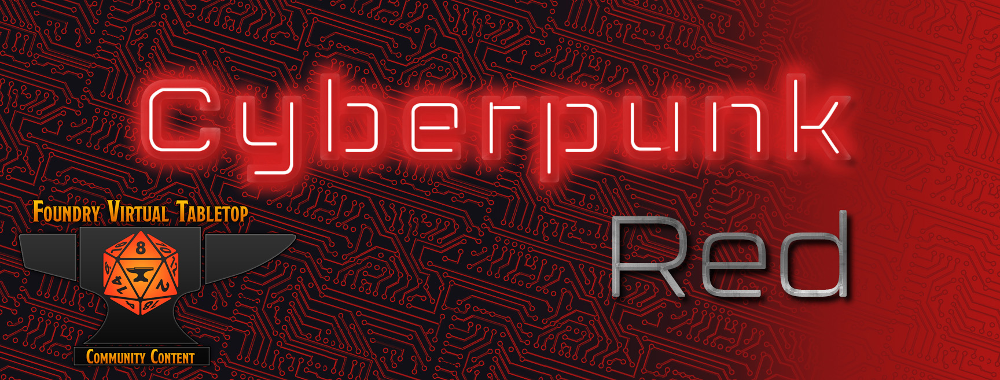

# Cyberpunk RED - Welcome to The Street!

<!-- markdownlint-disable-next-line MD033 -->

<!-- markdownlint-disable-next-line MD033 -->

A implementation for the Cyberpunk RED TRPG Core Roles for Foundry VTT.

> DISCLAIMER: This game system is unofficial content provided under the Homebrew Content Policy of R. Talsorian Games and is not approved or endorsed by RTG. This content references materials that are the property of R. Talsorian Games and its licensees.

This project is under heavy development to get a working experience together, so please prepare yourself for a lot of change when using this it. We aim to be responsive so if you have suggestions, concerns, or ideas, please come talk to us!

## Getting Started

If you are a game master or player and curious about how Cyberpunk runs in Foundry VTT, [why not check out our extensive wiki articles](https://gitlab.com/JasonAlanTerry/fvtt-cyberpunk-red-core/-/wikis/home), or this [YouTube playlist showcasing updates and walkthroughs.](https://www.youtube.com/playlist?list=PL4-W5wKEr1fm57F9qnF8a7opYJ1pBt36X) If you want to contribute to developing the system, read on!

## Installing

The recommended installation method is with the usual FoundryVTT installer (see the [tutorial](https://foundryvtt.com/article/tutorial/)). Our work is listed as [https://foundryvtt.com/packages/cyberpunk-red-core](https://foundryvtt.com/packages/cyberpunk-red-core).

<!-- markdownlint-disable-next-line MD034 -->
Manifest: https://gitlab.com/api/v4/projects/22820629/packages/generic/fvtt-cyberpunk-red-core/latest/system.json

## Release Notes

See [CHANGELOG.md](https://gitlab.com/JasonAlanTerry/fvtt-cyberpunk-red-core/-/blob/master/CHANGELOG.md)

## Join the team!

Chat with us on [Discord](https://discord.gg/hpyz2nf6Vk)!

If you're interested in helping out, we would love to hear from you! Even if you're not a coder we can help you get started. Never too late to start a new hobby! Look over the [project wiki](https://gitlab.com/JasonAlanTerry/fvtt-cyberpunk-red-core/-/wikis/home).

To get a sense of the project's direction, the tools we use, and how we're organized please read the Development Documentation on the [Wiki](https://gitlab.com/JasonAlanTerry/fvtt-cyberpunk-red-core/-/wikis/home#development-documentation).
